#  Eato - Online Food Ordering System

<p align="center">
  
</p>

## Overview
Eato is a Django + MySQL based Online Food Ordering System with separate **Admin** and **User** panels.

## Features
- User Registration & Login
- Admin Login
- Dashboard
- Category Management
- Product Management
- Banner Management
- Shopping Cart
- Payment (Demo)
- Order Management
- Incoming Orders
- My Orders
- Responsive Bootstrap UI

---

# 🛠 Requirements

- Python 3.11+
- MySQL Server 8+
- Git (Optional)
- VS Code
- pip

---

# 1. Clone / Download

```bash
git clone <repository-url>
cd eato_project
```

Or extract the ZIP.

---

# 2. Create Virtual Environment

```bash
python -m venv venv
```

Activate

Windows

```bash
venv\Scripts\activate
```

Linux / Mac

```bash
source venv/bin/activate
```

---

# 3. Install Django

```bash
pip install django
```

Install MySQL driver

```bash
pip install mysqlclient
```

If mysqlclient fails:

```bash
pip install pymysql
```

---

# 4. Install Requirements

```bash
pip install -r requirements.txt
```

or

```bash
pip install django mysqlclient pillow
```

---

# 5. Create MySQL Database

```sql
CREATE DATABASE eato_db;
```

Create user (optional)

```sql
CREATE USER 'eato'@'localhost' IDENTIFIED BY 'password';
GRANT ALL PRIVILEGES ON eato_db.* TO 'eato'@'localhost';
FLUSH PRIVILEGES;
```

---

# 6. Configure settings.py

```python
DATABASES = {
    'default': {
        'ENGINE':'django.db.backends.mysql',
        'NAME':'eato_db',
        'USER':'root',
        'PASSWORD':'your_password',
        'HOST':'127.0.0.1',
        'PORT':'3306',
    }
}
```

Media

```python
MEDIA_URL='/media/'
MEDIA_ROOT=BASE_DIR/'media'
```

urls.py

```python
from django.conf import settings
from django.conf.urls.static import static

urlpatterns += static(settings.MEDIA_URL, document_root=settings.MEDIA_ROOT)
```

---

# 7. Apply Migrations

```bash
python manage.py makemigrations
python manage.py migrate
```

---

# 8. Create Superuser

```bash
python manage.py createsuperuser
```

Example

Username

```
admin
```

Email

```
admin@eato.com
```

Password

```
admin123
```

---

# 9. Run Server

```bash
python manage.py runserver
```

Open

```
http://127.0.0.1:8000/
```

---

# Images

# Images

| Screen | Image |
|---------|-------|
| Index | 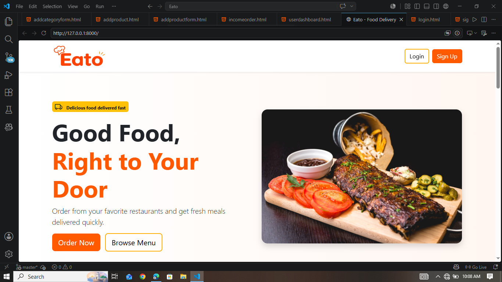 |
| Login | 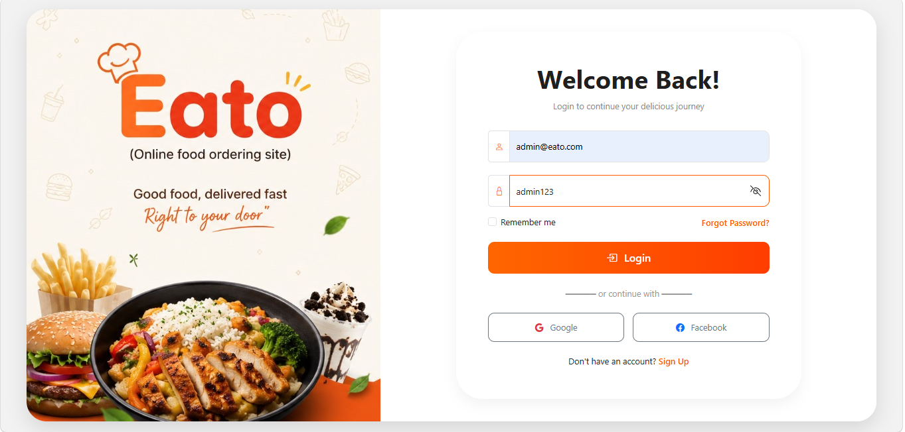 |
| Signup | 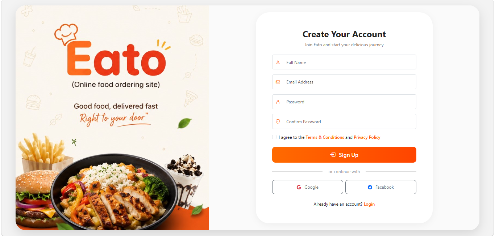 |
| Admin Dashboard | 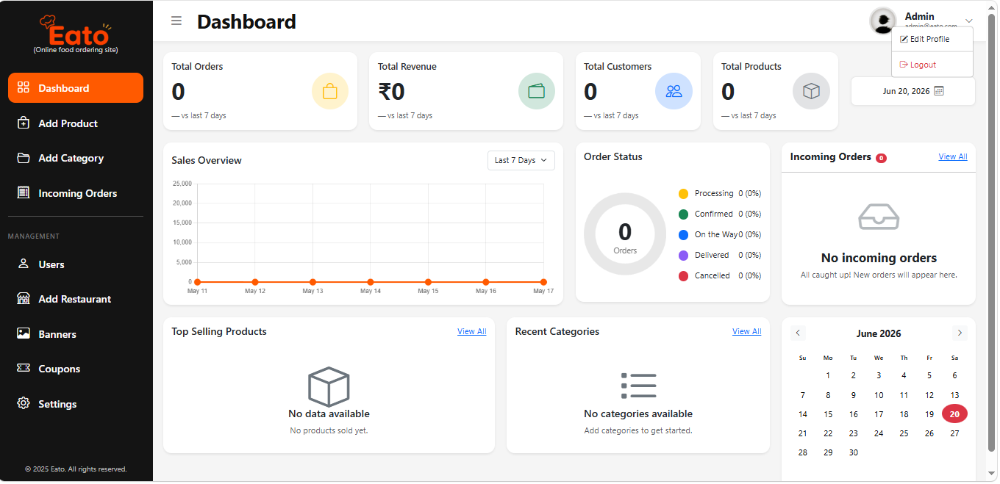 |
| Add Product | 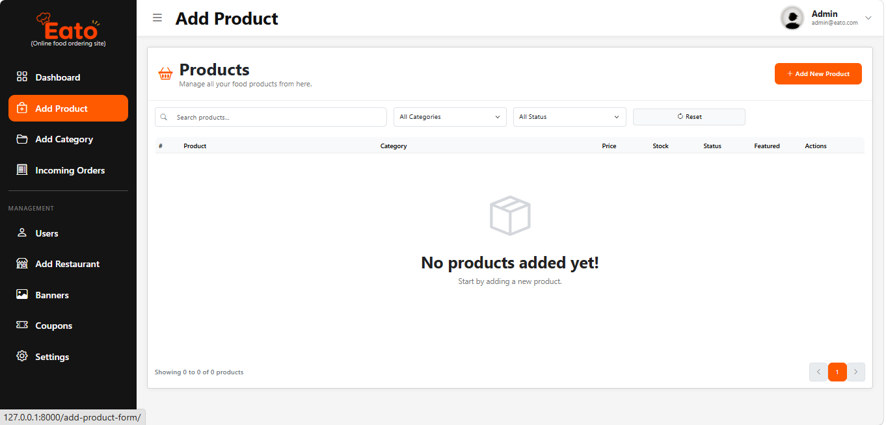 |
| Add Product Form 1 | 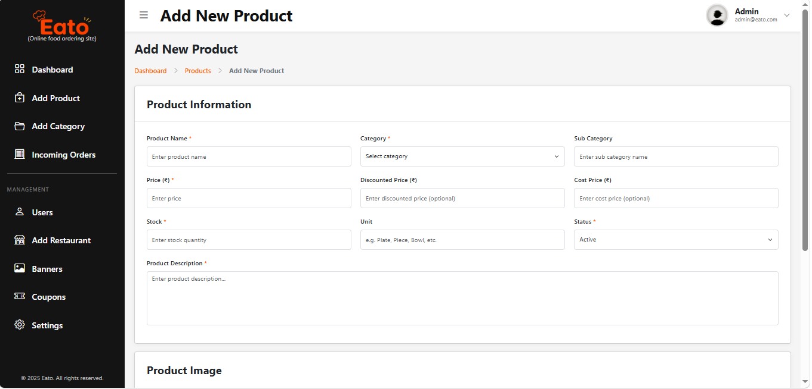 |
| Add Product Form 2 | 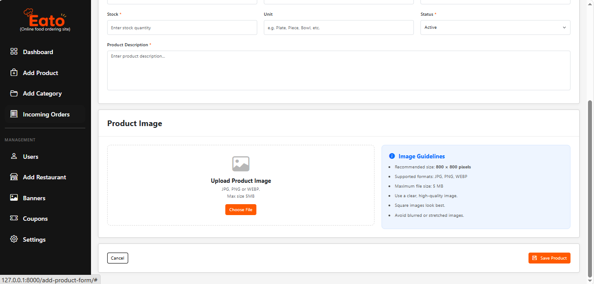 |
| User Dashboard | 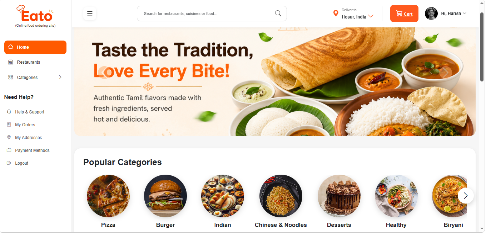 |
| User Dashboard Foods | 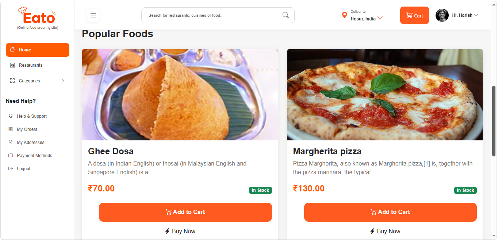 |
| Cart | 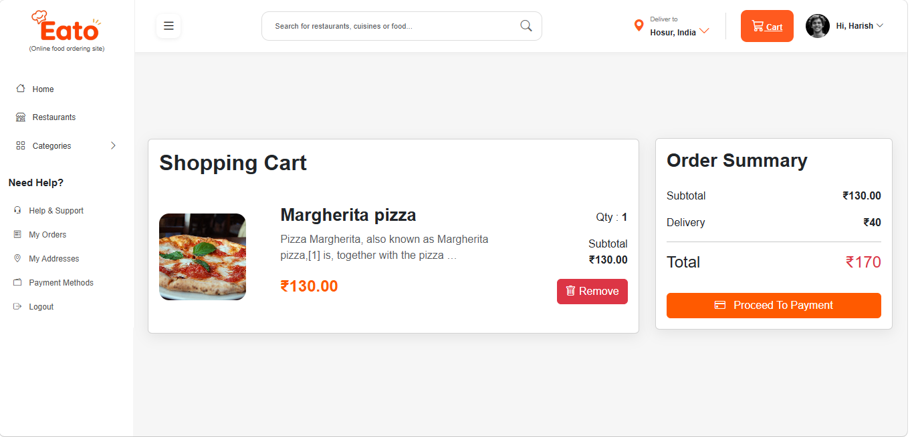 |
| Payment | 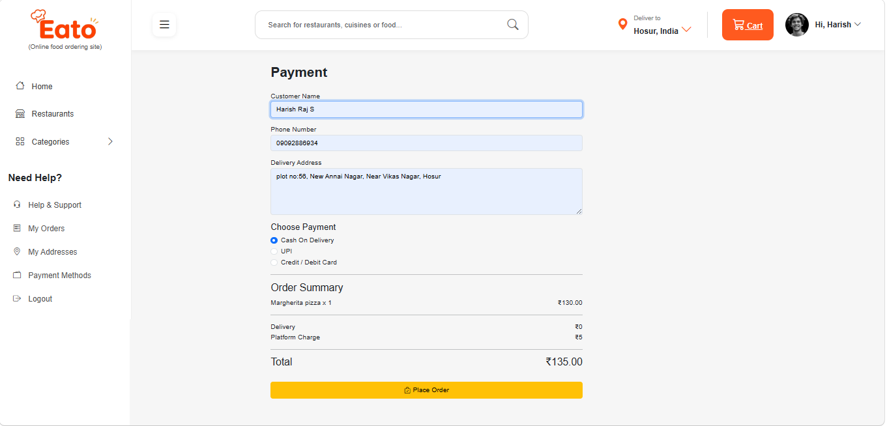 |
| Order Success | 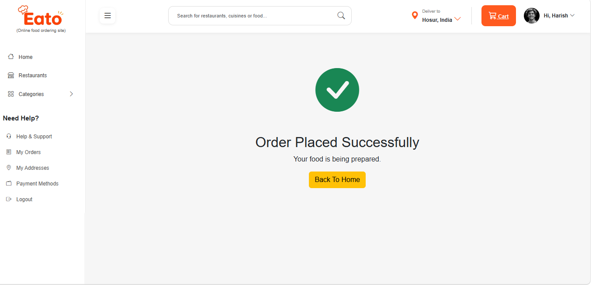 |
| My Orders | 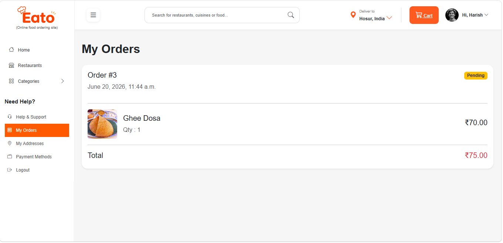 |
| Incoming Orders | 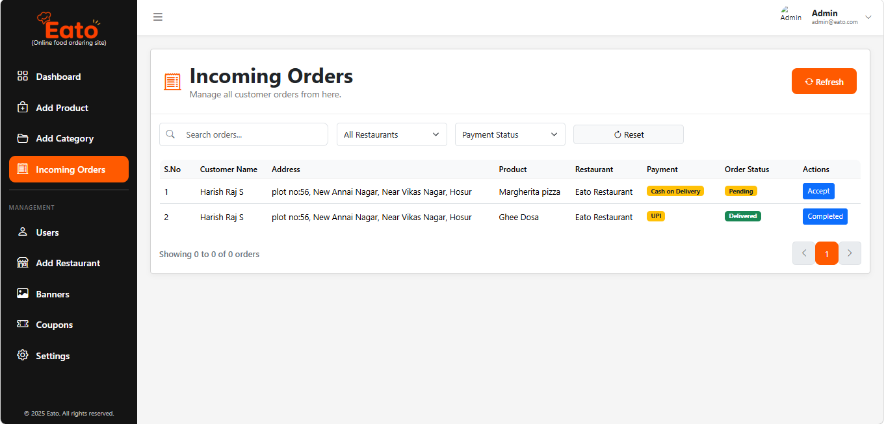 |
---

# Project Flow

```text
Landing Page
      |
 Login / Signup
      |
 User Dashboard
      |
 Categories
      |
 Products
      |
 Add To Cart
      |
 Payment
      |
 Order Success
      |
 My Orders

                 Admin
                    |
             Admin Dashboard
                    |
   Category -> Product -> Banner
                    |
          Incoming Orders
```

---

# Useful Commands

```bash
python manage.py makemigrations
python manage.py migrate
python manage.py createsuperuser
python manage.py runserver
```

---

# Tech Stack

- Django
- Python
- Bootstrap 5
- HTML5
- CSS3
- JavaScript
- MySQL
- Pillow
